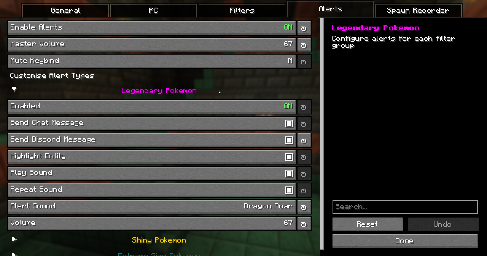
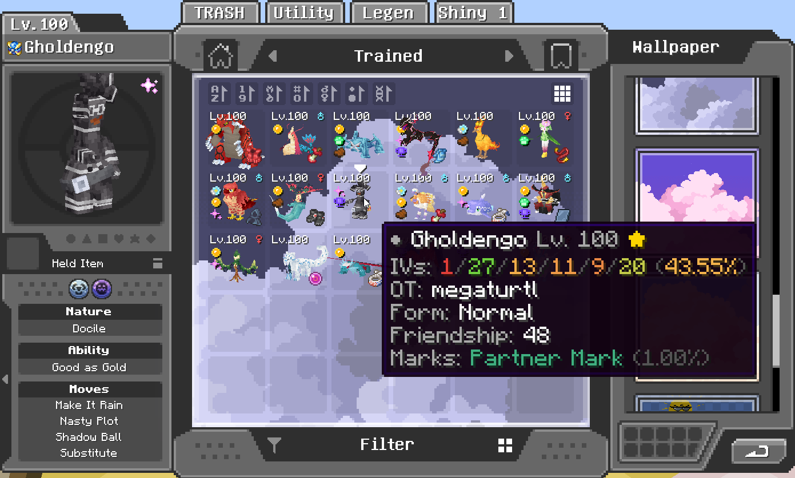
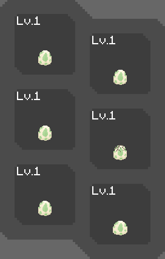
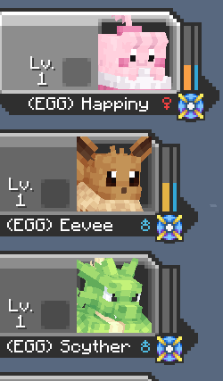
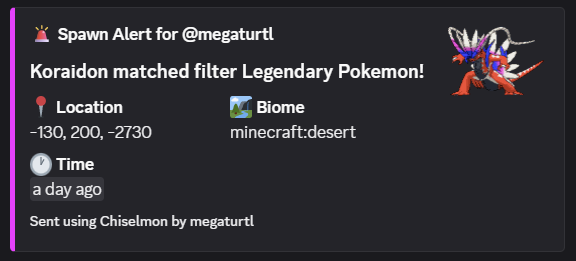
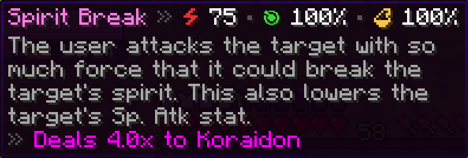
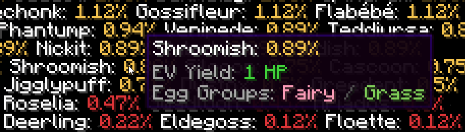
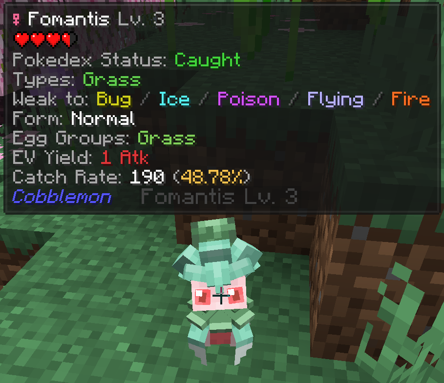
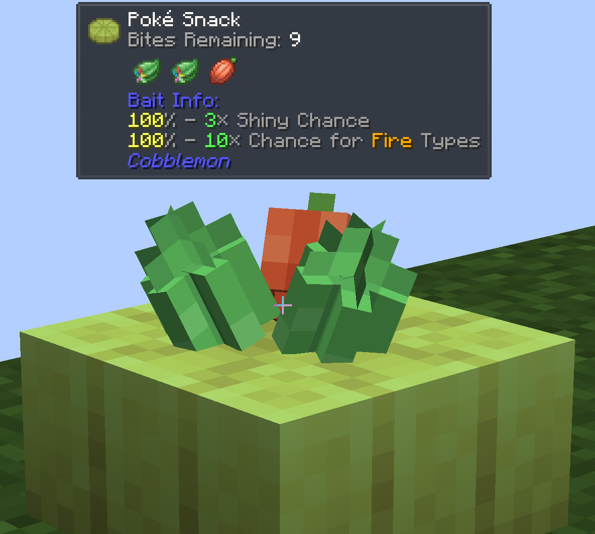

# Chiselmon

 

Sculpt your perfect Cobblemon experience with deeply customisable QOL tweaks!

## Installation
Chiselmon is a fully client side Cobblemon sidemod for Fabric and NeoForge.

To use Chiselmon, make sure you have Cobblemon 1.7.0+ and [Yet Another Config Lib](https://modrinth.com/mod/yacl) installed. To get the most out of the mod, consider also installing [Jade](https://modrinth.com/mod/jade).

## Customising Your Tweaks
If you haven't used Chiselmon before, I recommend exploring the config options beforehand so you can see what features are available.

You can open the Chiselmon config in 3 ways:
1. Click the Chiselmon icon in your mod menu.
2. Use the `/ch config` command in-game.
3. Press the hotkey. The default is `;`, but this can be changed in the config.

## Features
### PC Overhaul:

- **Bookmark up to 5 boxes** and jump to them at any time.
- **10 new wallpapers**. Hold `Ctrl` while choosing to apply a selected wallpaper to every box at once.
- **Quick-sort any box**. Default hotkey is `Middle-Click`.
- **6 unique icons** to easily identify special pokemon (shiny, high IVs, hidden ability, extreme size, marks, rideable).
- **Detailed tooltips** showing IVs, original trainer, form, friendship, ride styles, marks, and egg hatch progress.
- **2 new box sorting modes**. Sort by Pokemon size and total IVs.

### Egg Spy:

- Use Chiselmon's cutting edge ultrasound technology to preview what's inside pokemon eggs (NeoDaycare only).
- Optionally replaces the HP and XP bar of eggs in your party overlay with their hatch progress so you can easily keep track while hatching.
### Spawn Alerts:

- Alert system for legendaries, shinies, size variations, or custom whitelisted pokemon that spawn around you.
- Create unlimited custom filters to receive alerts for with Chiselmon's logic building system.
- 4 Fully configurable alert types per filter - chat messages, Discord webhook messages, sounds, colored highlights.
- Mute all active alert sounds with the 'M' keybind (configurable in Minecraft controls and Chiselmon config).
### Spawn Recorder:
- Records total pokemon spawns and the number of each species in the current session.
- Use the `/ch recorder start, stop, pause, and resume` commands to manage your session.
- Optional action bar display: shows the total spawns and time passed since starting, and the number of currently loaded pokemon + how many are old enough to start despawning.
- Optional despawn glow: highlights loaded pokemon in green, turning red when they're ready to despawn.
### Misc:
#### Move Tooltips

#### /checkspawn Improvemennts

`/checkspawn` results now have hoverable tooltips showing egg group and EV yield info to make cake hunting easier.
### Jade Addons:
#### Pokemon Extra Info

  - Types
  - Weaknesses
  - Form
  - Pokedex status
  - Egg groups
  - EV yield
  - Catch rate
  - Catch chance % (when holding a Pokeball - considers level, status, etc!)
  - Warnings for self-damaging moves - never lose a shiny to explosion again! </3
#### Poke Snack Extra Info:

  - Bites remaining
  - Ingredients
  - Seasoning effects