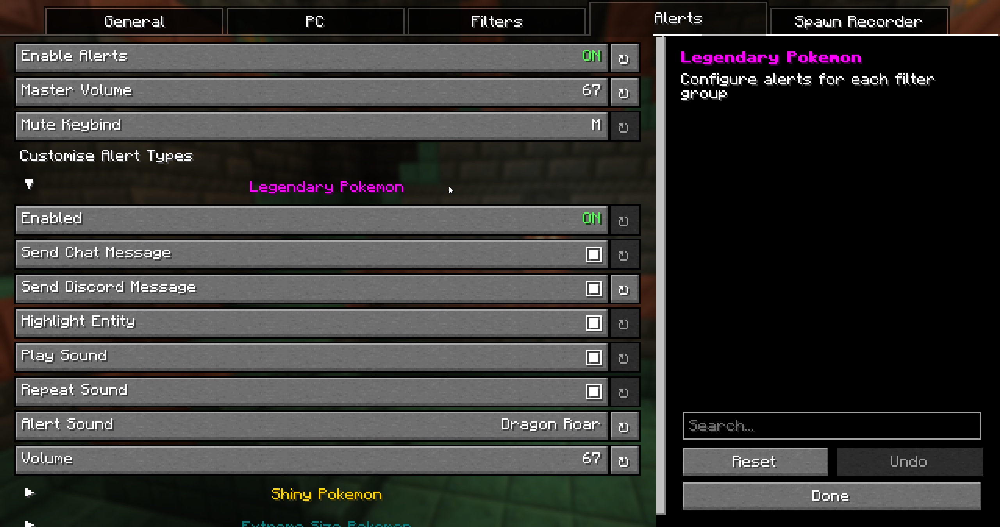
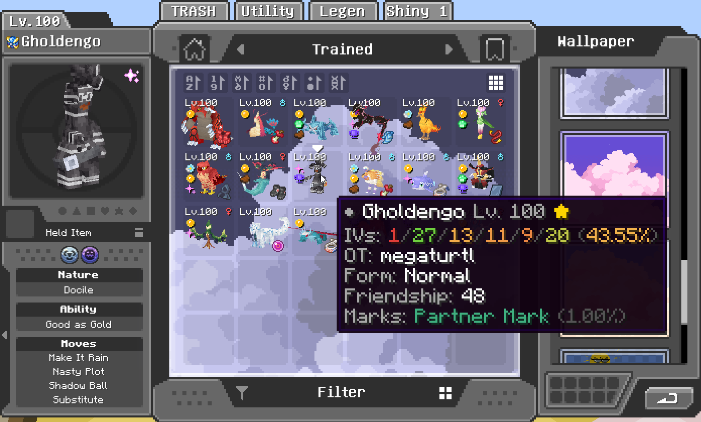
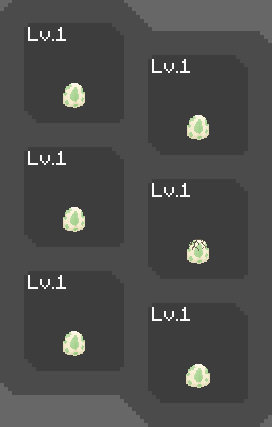
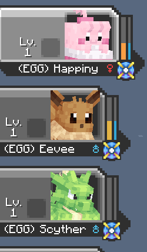
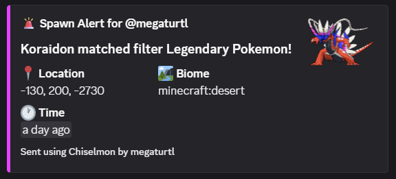
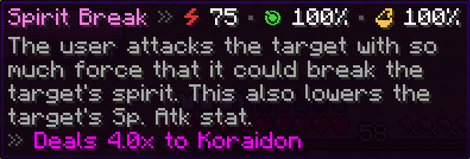
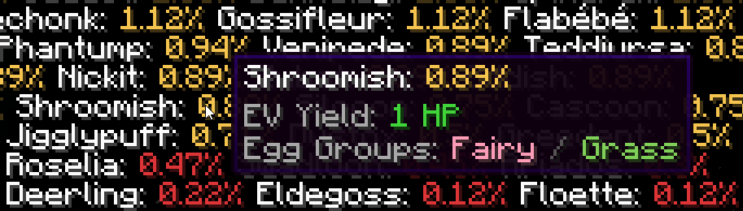
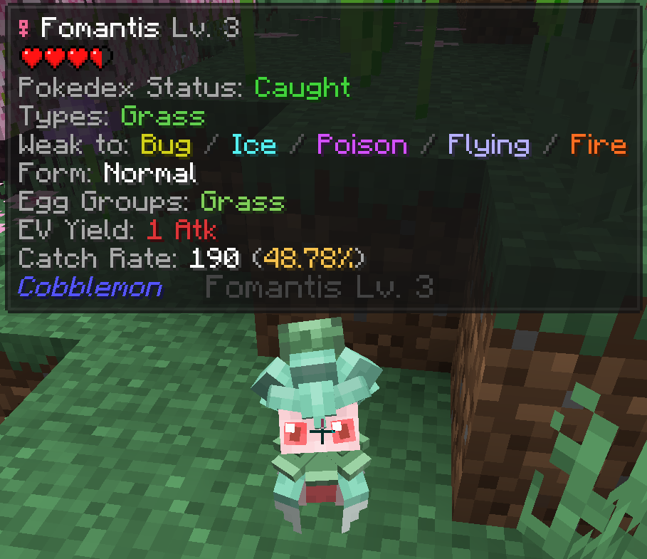
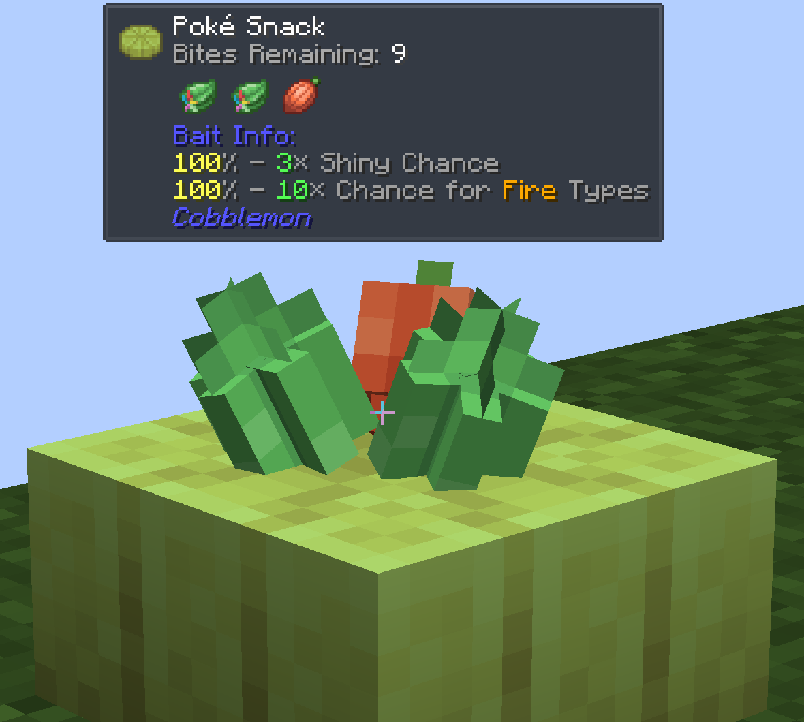

# Chiselmon

[](https://modrinth.com/mod/chiselmon)
[](https://discord.gg/wFRFqQK9WW)
<br>


Sculpt your perfect Cobblemon experience with deeply customisable QOL tweaks!

## Installation
Chiselmon is a fully client side Cobblemon sidemod for Fabric and NeoForge.

To use Chiselmon, make sure you have Cobblemon 1.7.0+ and [Yet Another Config Lib](https://modrinth.com/mod/yacl) installed. To get the most out of the mod, consider also installing [Jade](https://modrinth.com/mod/jade).

## Customising Your Tweaks
If you haven't used Chiselmon before, I recommend exploring the config options beforehand so you can see what features are available.


You can open the Chiselmon config in 3 ways:
1. Click the Chiselmon icon in your mod menu.
2. Use the `/ch config` command in-game.
3. Press the hotkey. The default is `;`, but this can be changed in the config.

## Features
### PC Overhaul:


- **Bookmark up to 5 boxes** and jump to them at any time.
- **10 new wallpapers**. Hold `Ctrl` while choosing to apply a selected wallpaper to every box at once.
- **Quick-sort any box**. Default hotkey is `Middle-Click`.
- **6 unique icons** to easily identify special pokemon (shiny, high IVs, hidden ability, extreme size, marks, rideable).
- **Detailed tooltips** showing IVs, original trainer, form, friendship, ride styles, marks, and egg hatch progress.
- **2 new box sorting modes**. Sort by Pokemon size and total IVs.


### Egg Spy:


- Use Chiselmon's cutting edge ultrasound technology to preview what's inside pokemon eggs (NeoDaycare only).
- Optionally replaces the HP and XP bar of eggs in your party overlay with their hatch progress so you can easily keep track while hatching.
### Spawn Alerts:

- Alert system for legendaries, shinies, size variations, or custom whitelisted pokemon that spawn around you.
- Create unlimited custom filters to receive alerts for with Chiselmon's logic building system.
- 4 Fully configurable alert types per filter - chat messages, Discord webhook messages, sounds, colored highlights.
- Mute all active alert sounds with the 'M' keybind (configurable in Minecraft controls and Chiselmon config).
### Spawn Recorder:
- Records total pokemon spawns and the number of each species in the current session.
- Use the `/ch recorder start, stop, pause, and resume` commands to manage your session.
- Optional action bar display: shows the total spawns and time passed since starting, and the number of currently loaded pokemon + how many are old enough to start despawning.
- Optional despawn glow: highlights loaded pokemon in green, turning red when they're ready to despawn.
### Misc:
#### Move Tooltips


#### /checkspawn Improvemennts

`/checkspawn` results now have hoverable tooltips showing egg group and EV yield info to make cake hunting easier.
### Jade Addons:
#### Pokemon Extra Info

  - Types
  - Weaknesses
  - Form
  - Pokedex status
  - Egg groups
  - EV yield
  - Catch rate
  - Catch chance % (when holding a Pokeball - considers level, status, etc!)
  - Warnings for self-damaging moves - never lose a shiny to explosion again! </3
#### Poke Snack Extra Info:

  - Bites remaining
  - Ingredients
  - Seasoning effects

---

# CI

### How versioning works

The base version is set once per release cycle in `gradle.properties`:

```properties
mod_version=1.1.0-alpha
```

Github Actions appends a build identifier to the base version depending on the context. Local builds use the base version as-is.

| Context | Example jar name | How the version is set |
|---|---|---|
| Local build | `chiselmon-fabric-1.1.0-alpha.jar` | Direct from `gradle.properties` |
| Merged to `main` | `chiselmon-fabric-1.1.0-alpha+a3f92c1.jar` | Base version + short commit SHA |
| Pull request | `chiselmon-fabric-1.1.0-alpha+pr42.b8d1f03.jar` | Base version + PR number + short SHA |
| Tagged release | `chiselmon-fabric-1.1.0-alpha.jar` | Taken directly from the tag name, `gradle.properties` ignored |

---

## The 3 Build Workflows

### `build-pull-request` - runs on every PR

Verifies that a PR compiles and produces valid jars for both platforms.
Artifacts are uploaded to the Actions run so you can download and test
them without checking out the branch locally.

This workflow is **read-only** with respect to the Gradle cache. PR code
is untrusted and cannot write to the cache that `main` branch builds
depend on.

### `build-commit` - runs on every push to `main`

Verifies that `main` is healthy after each merge, and **keeps the Gradle
cache warm**. This is the only workflow that writes to the cache, PRs read from this and can still build fast.

Artifacts are named by full commit SHA so any build from `main` is
permanently traceable.

### `build-tag` - runs when a `v*` tag is pushed

Builds the official release artifact. The version is taken from the tag
name, not `gradle.properties`, so the jar is always consistent with the tag.

This workflow will runs under the `prod` GitHub Environment to:
- Restrict deployments to tags matching `v*`
- (In the future) Require manual approval before the job runs. Will be useful if publishing gets set up.
- (In the future) Hold any private env variables separately from dev builds.

---

## Example: Creating a release build

1. Make sure `main` is in a state ready for release.
2. Push a tag:
   ```bash
   git tag v1.1.0-alpha
   git push origin v1.1.0-alpha
   ```
3. The `build-tag` workflow triggers.
4. Download the artifacts from the completed Actions run.

Tag naming convention: the tag name minus the `v` prefix becomes the
mod version. `v1.1.0` -> `1.1.0`. `v1.2.0-beta` -> `1.2.0-beta`.
